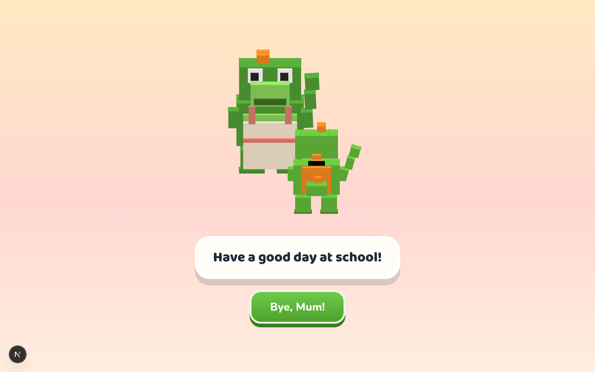
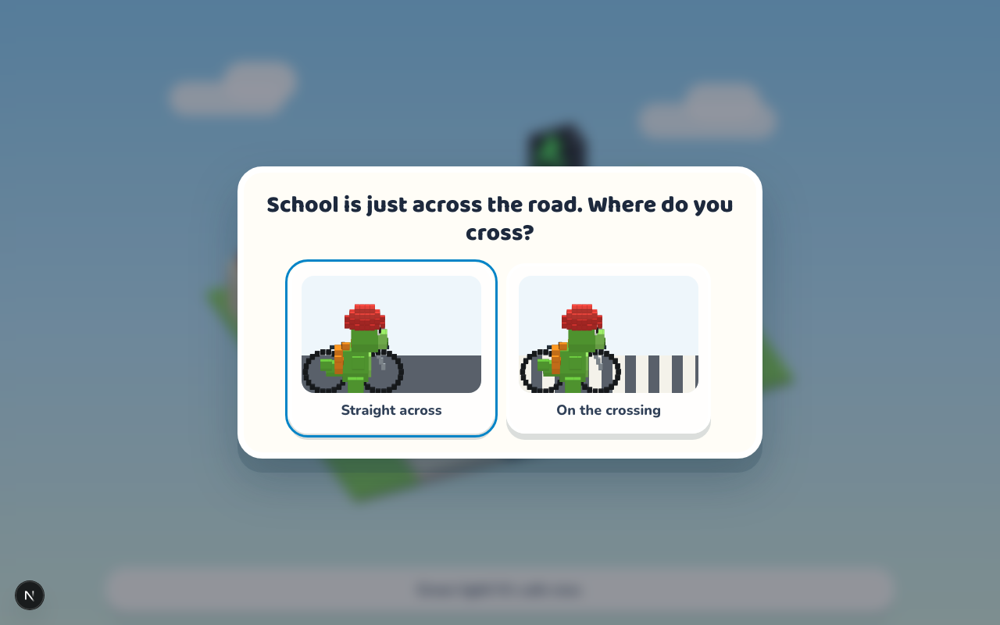
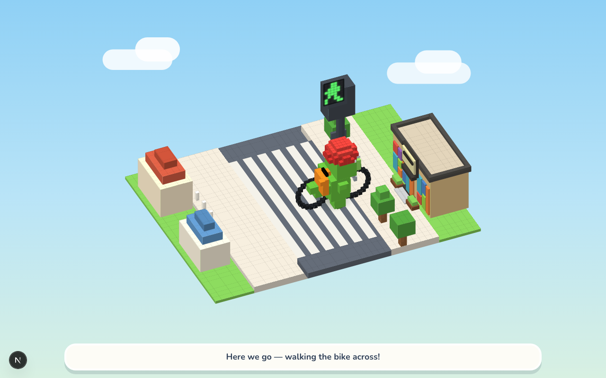

# Safe Steps 🚸

**세계의 모든 어린이가 안전하게 길을 건널 수 있도록 만들었습니다.**
**Built so that children everywhere can cross the road safely.**

### ▶︎ [지금 해보기 / Play now](https://cross-ecru.vercel.app/game)

> 화면의 가로가 세로보다 길어야 합니다. 세로로 긴 화면에서는 돌려 달라는 안내가 나옵니다.
> Needs a window wider than it is tall — a tall screen asks you to rotate it instead.

[한국어](#한국어) · [English](#english)



---

## 한국어

### 왜 만들었나

아이들에게 교통안전은 포스터와 훈화로 가르칩니다. "빨간불엔 멈춰라." 아이들은 이 말을 외웁니다.
그런데 **외운 것과 길 앞에 섰을 때 판단하는 것은 다른 일**입니다.

게다가 위험한 판단은 연습할 방법이 없습니다. 한 번 틀리면 안 되니까요.

Safe Steps 는 **안전하게 틀려볼 수 있는 곳**입니다.

### 무엇이 다른가

**오답이 벌점이 아니라 장면입니다.**

빨간불에 건너겠다고 고르면, 틀렸다는 문구가 뜨지 않습니다. 캐릭터가 실제로 도로에 한 발
나섰다가 멈춰 서서 되돌아옵니다. 왜 위험한지가 문장이 아니라 **장면으로 남습니다.**



선택지도 글이 아니라 움직임으로 보여줍니다. 글자를 아직 못 읽는 아이도 두 선택의 차이를
눈으로 구별할 수 있습니다.

### 어떻게 진행되나

엄마의 배웅으로 시작하는 등교길 한 편입니다. 네 번의 판단이 있습니다.

1. **자전거를 탈 때 무엇을 챙길까** — 피자와 헬멧
2. **횡단보도에서 타고 건널까, 내려서 끌까**
3. **어느 불에 건널까** — 초록과 빨강
4. **어디로 건널까** — 무단횡단과 횡단보도

넷을 모두 통과하면 길 건너 학교에 도착합니다.



### 만드는 방식

화면의 모든 것 — 도로, 신호등, 캐릭터, 자전거, 학교 — 이 CSS 3D 변환으로 그린 복셀입니다.
3D 라이브러리도, 캐릭터 이미지 파일도 쓰지 않습니다. 덕분에 캐릭터의 색을 바꾸거나 헬멧을
씌우는 일이 이미지를 다시 그리는 대신 코드 한 줄이 됩니다.

### 실행

배포본은 **<https://cross-ecru.vercel.app/game>** 에서 바로 볼 수 있습니다. 직접 돌리시려면:

```bash
npm install
npm run dev
```

`http://localhost:3000` 을 엽니다. 게임 화면이 좌·중앙·우 3열이라 **가로가 세로보다 길어야**
동작합니다. 세로로 긴 화면에서는 화면을 돌리거나 창을 넓혀 달라는 안내가 대신 나옵니다.

---

## English

### Why

Road safety is taught to children with posters and lectures. "Stop at the red light."
Children memorise the words. But **knowing the words and making the judgement at the kerb
are two different things.**

And a dangerous judgement is one you cannot practise. Getting it wrong once is once too many.

Safe Steps is **a place where getting it wrong is safe.**

### What makes it different

**A wrong answer is a scene, not a penalty.**

Choose to cross on red and no message tells you that you were wrong. The character steps into
the road, stops, and pulls back. Why it was dangerous stays with the child **as something they
watched**, not as a sentence they read.

Choices are shown as motion rather than described in words, so a child who cannot yet read the
labels can still tell the two options apart.

### How it goes

One morning walk to school, starting with mum waving goodbye. Four decisions:

1. **What do you take when you ride?** — pizza or helmet
2. **Ride across, or get off and walk?**
3. **Which light do you cross on?** — green or red
4. **Where do you cross?** — straight across, or on the crossing

Get all four right and you arrive at the school across the road.

### How it is built

Everything on screen — the road, the signal, the character, the bike, the school — is voxels
drawn with CSS 3D transforms. No 3D library, no character image files. That is why recolouring
the character or putting a helmet on it is a line of code rather than a redrawn sprite.

### Running it

A deployed copy lives at **<https://cross-ecru.vercel.app/game>**. To run it yourself:

```bash
npm install
npm run dev
```

Open `http://localhost:3000`. The game lays out in three columns, so it **needs a window wider
than it is tall**. On a tall screen it asks you to rotate the device or widen the window
instead.

---

## Licence

MIT
